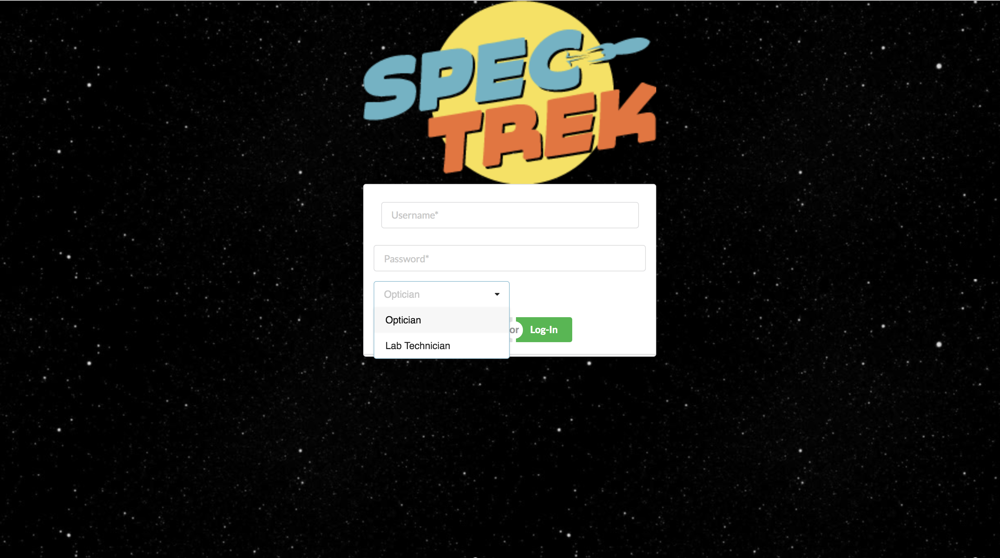
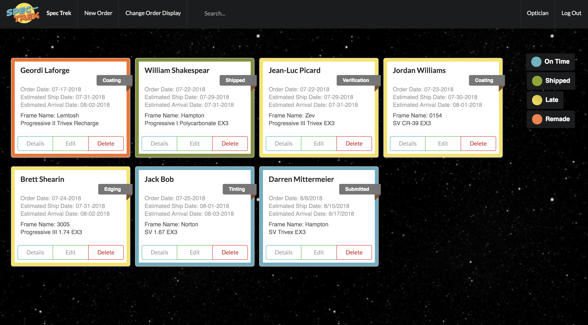
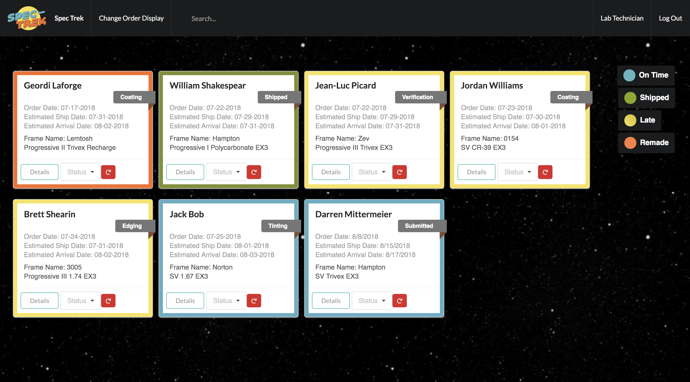

# * Spec Trek *

This is my Front-End Capstone for Nashville Software School.

# Tools:

- [x] HTML 
- [x] React
- [x] Semantic UI React
- [x] Javascript 

Create a new repository

run:
### `npm install`
inside of root repository.

run:
### `json-server -p 5002 -w  database.json`
inside of root repository to acess the database.

To register as an Optician:
Enter a username and password and select the "Optician" role.
As an Optician, you may make a New Order, Edit an order, and Delete an order.

To register as a Lab Technician:
Enter a username and password and select the "Lab Technician role.
As a Lab Tech, you may change the status of an order, and remake orders if necessicary.

The change order veiw function and search function are available in both views of the application.

This project was bootstrapped with [Create React App](https://github.com/facebookincubator/create-react-app).

